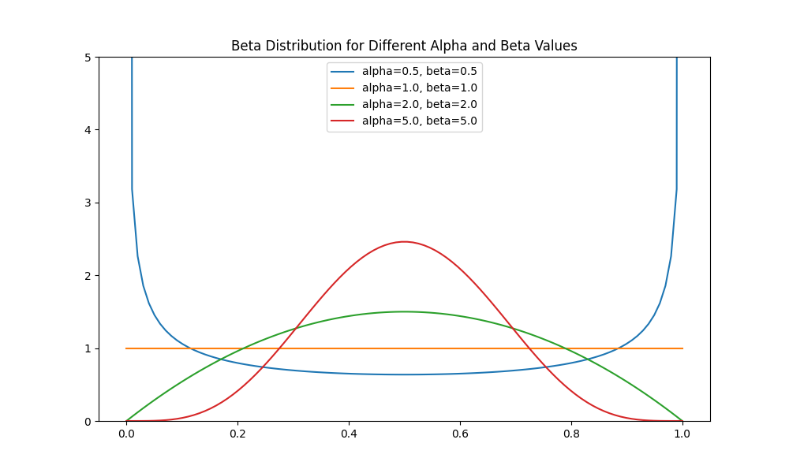
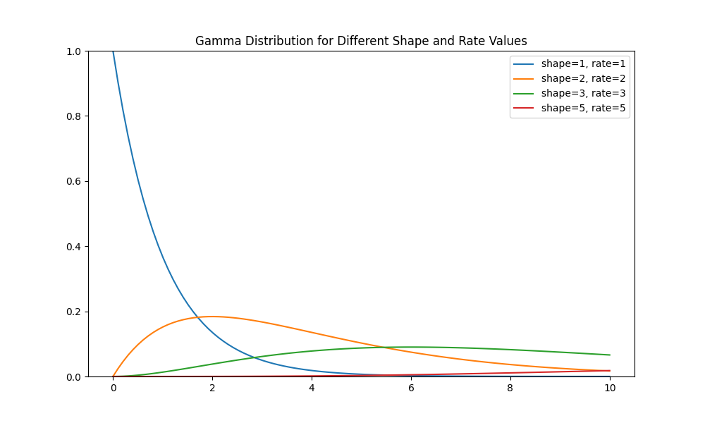

### Probabilistic Machine Learning (Revision & Recap) 
Revising & Recapping things from Probability Machine Learning, Kevin Murphy

#### Probabiliy Distributions (Beta, Gamma, Dirichlet)





### Other things 
* Luce-Shepard choice rule (mathematical model for choices based on matching law)

### Reference

```bibtex
@book{pml1Book,
 author = "Kevin P. Murphy",
 title = "Probabilistic Machine Learning: An introduction",
 publisher = "MIT Press",
 year = 2022,
 url = "[http://probml.github.io/book1](http://probml.github.io/book1)"
}